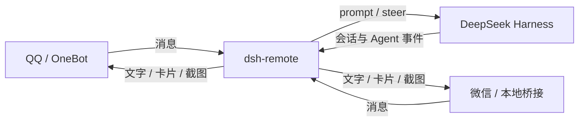

<div align="center">
  
  <h1>dsh-remote</h1>
  <p><strong>用 QQ 或微信，在手机上远程指挥 DeepSeek Harness。</strong></p>
  <p>选择工作区、派发任务、回答提问，并接收执行结果与桌面截图。</p>

  <p>
    <a href="LICENSE"></a>
    
    
    
  </p>

  <p>
    <a href="#快速开始">快速开始</a> ·
    <a href="docs/usage.md">使用指南</a> ·
    <a href="docs/configuration.md">配置参考</a> ·
    <a href="docs/internals.md">开发文档</a>
  </p>

  
</div>

---

## 为什么需要它

DeepSeek Harness 通常运行在电脑上，但任务不一定需要你一直坐在电脑前。
`dsh-remote` 把聊天软件变成 DSH 的远程控制台：消息进入指定会话，执行结果自动回到手机。

```text
QQ / 微信  ── 指令 ──▶  dsh-remote  ── 用户消息 ──▶  DeepSeek Harness
QQ / 微信  ◀─ 汇报 ──  dsh-remote  ◀─ 事件 / 工具 ──  DeepSeek Harness
```

## 功能亮点

| 功能 | 说明 |
|---|---|
| 远程派活 | 将聊天消息投递到选定的 DSH 会话 |
| 自动汇报 | 每轮结束自动推送回答，并标明工作区与会话 |
| 会话管理 | 列出、切换、新建、恢复、分叉和停止会话 |
| 工作区管理 | 选择、新建工作区，并修复未分组会话 |
| 远程答问 | 在手机上回答 Agent 的选择题或自由文本问题 |
| 截图与附件 | 获取桌面截图；QQ 通道支持收取附件 |
| 可视化会话树 | 查看工作区、分叉和子代理，直接切换目标 |
| 工作模式 | 为不同场景配置命令、投递方式和系统提示词 |
| Agent 主动通知 | 通过 `remote_notify` 主动汇报进度或异常 |
| 双通道 | QQ 与微信可同时启用，通知自动广播 |

<details>
<summary><strong>查看手机端命令卡片</strong></summary>

<p align="center">
  
</p>

</details>

## 快速开始

### 前置条件

- 已安装并能正常运行的 DeepSeek Harness
- Python 3 与 [Pillow](https://pypi.org/project/pillow/)
- QQ 通道：一个 OneBot 11 实现，推荐 NapCat
- 微信通道与桌面截图：Windows

### 安装

**方式一：插件市场（推荐）**

装好 [dsh-market](https://github.com/dsh-market/dsh-market) 后打开 **设置 → 插件市场**，搜索 `dsh-remote`，
一键安装。市场会把依赖装进 profile，并把 `dsh-remote` 加进 `dsh.profile.bundles`。

**方式二：官方安装命令**

```bash
dsh plugin --profile web add github:BlueRose2020/dsh-remote
```

这个命令会识别包里的 `dsh.bundle`：依赖装进 profile，`dsh-remote` 也会自动加进
`$DSH_HOME/profiles/web/package.json` 的 `dsh.profile.bundles` —— 启动器靠那份列表加载这一层。
（万一没加上，手写一行即可：`"bundles": ["@deepseek-ai/dsh-base", "@deepseek-ai/dsh-web-app", "dsh-remote"]`。）

**方式三：手动放源码**（要改代码时用）

1. 把仓库放到：

   ```text
   $DSH_HOME/profiles/plugins/dsh-remote
   ```

2. 将 [`cordis.patch.yml`](cordis.patch.yml) 中的 `insert` 合并到
   `$DSH_HOME/profiles/web/cordis.patch.yml`，并把 `name:` 换成入口文件路径：

   ```yaml
   - insert:
       - id: remote-channel
         name: ../plugins/dsh-remote/lib/index.js
         config:
           enabled: true
           transports:
             - onebot
             # - wechat-local
   ```

**Python 依赖**（三种方式都要）

```bash
pip install -r requirements.txt
```

最后重启一次 DSH（新装 bundle 属于启动时组合的层；市场会给出重启提示），
打开 **设置 → 插件 → 远程通道**，启用需要的通道。

> [!TIP]
> 插件自带 `dsh.bundle` manifest，所以「市场一键安装」和上面的命令行装法拿到的是同一份东西：
> 包里的 [`cordis.patch.yml`](cordis.patch.yml) 会被启动器自动应用，不用手工复制。
> NapCat、OneBot WebSocket 和微信 bridge 的完整配置见[安装指南](docs/install.md)。

## 基本使用

普通文本会直接发送到当前会话，无需 `#`：

```text
帮我检查项目测试，完成后截图
```

`#` 只用于插件管理命令，例如 `#status`、`#use` 和 `#stop`。原有的 `#任务内容` 写法仍然兼容。

### 常用命令

| 命令 | 用途 |
|---|---|
| `#help` | 显示完整命令卡片 |
| `#status` | 查看目标会话、通道和权限状态 |
| `#sessions` | 列出会话 |
| `#use <序号或名称>` | 切换目标会话 |
| `#ws` | 列出或选择工作区 |
| `#new` | 新建会话 |
| `#reply <内容>` | 回复最近向你发送消息的会话 |
| `#tree` | 查看会话分叉树与工作区树 |
| `#shot [窗口标题]` | 获取桌面截图 |
| `#stop` | 停止当前任务 |
| `#mode` | 查看或切换工作模式 |
| `#img on / off` | 切换图片卡片与纯文字回复 |

完整命令、远程答问、附件和分叉说明见[使用指南](docs/usage.md)。

## 传输通道

| | QQ / OneBot | 微信 / 本地桥接 |
|---|---|---|
| 实现 | OneBot 11 WebSocket | 截图 OCR + 剪贴板 |
| 准确性 | 高，协议级文本 | 受 OCR 影响 |
| 桌面干扰 | 无 | 发送时会短暂占用键鼠 |
| 推荐场景 | 日常首选 | 无法使用 QQ 时备用 |

两个通道可同时启用。通知会广播到所有就绪通道，回复则返回消息来源通道。

## 常用配置

配置写在插件挂载项的 `config` 下；网页面板中的设置优先。

| 配置项 | 默认值 | 说明 |
|---|---:|---|
| `transports` | `[wechat-local]` | 启用 `onebot`、`wechat-local` 或两者 |
| `commandPrefix` | `#` | 插件管理命令前缀；普通文本不需要前缀 |
| `onebot.ownerId` | 空 | QQ 通知目标 |
| `reportOnlyRemoteTurns` | `true` | 只汇报远程通道触发的轮次 |
| `reportWithScreenshot` | `false` | 每次汇报附带桌面截图 |
| `screenshotMonitor` | `primary` | `primary`、`all` 或显示器序号 |
| `imageReplies` | `true` | 信息类回复使用图片卡片 |
| `avatar` | 空 | 自定义头像路径；`-` 表示不显示头像 |
| `accessGate` | `off` | `all` 表示所有指令都需要授权 |
| `debugLog` | 空 | JSONL 调试日志路径 |

所有字段、工作模式和通道参数见[配置参考](docs/configuration.md)。

## 安全设计

> [!WARNING]
> 本插件可以间接驱动本机上的 DSH 执行操作。请只连接你信任的聊天账号，并检查白名单配置。

- 普通文本直接投递到当前会话，管理命令必须带前缀
- 所有群消息默认忽略
- QQ 私聊优先使用显式白名单或 `ownerId`
- 默认每分钟最多处理 20 条指令
- 管理员密码只在提升到完全权限时使用
- 微信发送前确认当前窗口是文件传输助手
- `wechat.passive` 默认开启，轮询不会切换窗口或移动鼠标

使用 `#status` 可以随时核对允许发指令的账号和当前权限。

## 架构



插件本身负责命令、权限、状态与 DSH 生命周期集成；消息收发由可插拔传输层处理。

## 开发

```bash
npm install
npm test
```

常用检查：

```bash
npm run check                    # 全部运行时代码语法检查
node tools/client-half-check.mjs # 浏览器端交互测试
node tools/onebot-e2e.mjs        # OneBot 端到端测试
python tools/path_check.py       # 路径渲染测试
node tools/ui-preview.mjs        # 生成浅色 / 深色 UI 预览
```

修改 `lib/*.js` 或 `bridge/*.py` 后需要重启 DSH。实现细节、测试范围和重启说明见[开发文档](docs/internals.md)。

## 文档

| 文档 | 内容 |
|---|---|
| [安装指南](docs/install.md) | NapCat、OneBot、微信 bridge、验证与回滚 |
| [使用指南](docs/usage.md) | 命令、卡片、远程答问、附件与分叉 |
| [配置参考](docs/configuration.md) | 全部配置项、默认值与工作模式 |
| [开发文档](docs/internals.md) | 架构、测试、调试、重启与已知限制 |

## 贡献

欢迎提交 [Issue](https://github.com/BlueRose2020/dsh-remote/issues) 或 Pull Request。
提交前请先运行 `npm test`，并确保相关行为有对应测试。

## 许可证

[MIT](LICENSE) © BlueRose2020
