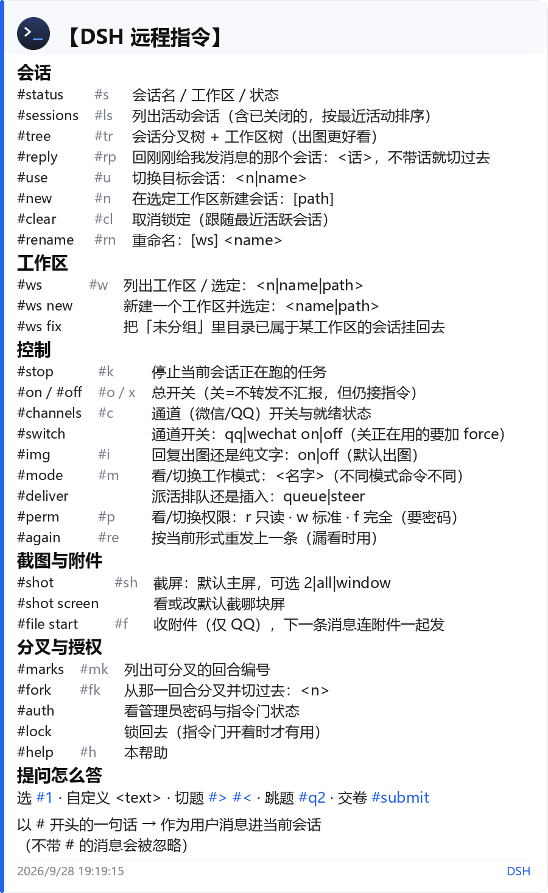

# dsh-plugin-remote — 远程通道

用手机上的聊天软件远程指挥 DeepSeek Harness：**选工作区 → 派活 → 收汇报（含截图）**。

这是一个 **DSH 插件**。它挂在 DSH 的服务和事件上（会话、工作区、Agent 生命周期、工具注册），
自己不做业务；"消息怎么进出"交给可插拔的**传输层**。

```
┌──────────────┐   prompt    ┌───────────────────────────────┐
│  传输层       │ ──────────► │  DSH                          │
│  onebot (QQ) │             │  sessionController / agents    │
│  wechat-local│ ◄────────── │  workspaceRegistry            │
└──────────────┘   汇报/截图  └───────────────────────────────┘
```

| 想知道什么 | 看哪 |
|---|---|
| 怎么装，QQ / 微信 怎么接上 | [`docs/install.md`](docs/install.md) |
| 每条指令、卡片、问答、分叉的完整说明 | [`docs/usage.md`](docs/usage.md) |
| 全部配置项和默认值 | [`docs/configuration.md`](docs/configuration.md) |
| 改代码、跑测试、已知限制 | [`docs/internals.md`](docs/internals.md) |

---

## 1. 能做什么

| 能力 | 说明 |
|---|---|
| 远程派活 | 你发的消息作为**用户消息**进入指定会话，Agent 立刻开始干活 |
| 及时汇报 | 每轮结束把 Agent 的回答原文推回聊天，开头是 `工作区 - 会话名` |
| 截图 | `#shot [窗口标题]` 把桌面截图发给你；Agent 也可用 `remote_screenshot` 工具 |
| 问题通知 | `agent/error`、`ask_user_question`、审批请求发生时，主动推到你手机 |
| 远程答问 | Agent 弹出的选择题，在聊天里回 `1` / `#1` / 自定义文字就答了 |
| 选工作区 / 会话 | `#ws` / `#sessions` 列出，按名字或序号选定；`#new` 直接开新会话 |
| 多会话切换 | `#reply <话>` 回「刚刚给我发消息的那个会话」，不用先查它是几号 |
| 可视化树 | `#tree` 出会话分叉树 + 工作区树；网页端点头像还有一棵能折叠、能点的树 |
| 工作模式 | 一套行为 + 一套命令：`#mode` 切换，命令表和 `#help` 跟着变 |
| 紧急停止 | `#stop` 取消当前会话正在跑的任务 |
| Agent 主动汇报 | `remote_notify` 工具，Agent 可以自己给你发消息 |
| 让 Agent 知道有人在看 | 往系统提示词注入一段 `## Remote operator` 说明；没有通道就绪时自动消失 |

## 2. 手机上怎么用

**命令不用背**：在聊天里发 `#help`，插件会当场渲染一张卡片发给你。

<p align="center"></p>

三条规矩：

- **消息要以 `#` 开头**（`commandPrefix` 可改）。`#` 后面不是内置命令词的，去掉 `#`
  之后作为**用户消息**进当前会话 —— 这就是派活：`#帮我把简历投了，投完截图给我`
- **汇报不用你去取**：一轮结束自动推回来。长任务里没消息，说明它还在跑（也可以开
  `progressEveryToolCalls` 让插件定期报进度）
- **Agent 反过来问你时，你发的消息就是答案**：带不带 `#` 都算，`1` 和 `#1` 都是选第 1 项，
  `#submit` 提前交卷

## 3. 安装

1. 插件目录放到 `$DSH_HOME/profiles/plugins/dsh-plugin-remote`
2. `pip install -r requirements.txt`（Pillow，渲染卡片用）
3. 把 `cordis.patch.yml` 里那段 `insert` 粘进 `$DSH_HOME/profiles/web/cordis.patch.yml`，
   按需改 `transports`：

   ```yaml
   - insert:
       - id: remote-channel
         # 必须写到入口文件：Node 的 ESM loader 不接受目录 URL
         name: ../plugins/dsh-plugin-remote/lib/index.js
         config:
           enabled: true
           transports:
             - onebot
             # - wechat-local
   ```

4. 让 DSH 重新加载 profile。**配置**是热加载的，改完即生效；**代码**不行，
   见 [`docs/internals.md`](docs/internals.md) 的「改代码之后必须重启」
5. 打开 DSH 设置 → 插件 → 「远程通道」，设管理员密码、开通道

QQ 侧要一个 OneBot 实现（NapCat 的坑、微信 bridge 怎么跑、怎么验证它没在碰你的窗口、
怎么回滚）都在 [`docs/install.md`](docs/install.md)。

## 4. 传输层

| | `onebot`（QQ） | `wechat-local`（微信） |
|---|---|---|
| 原理 | OneBot 11 协议，本地 WebSocket | 截图 OCR 读 + 剪贴板粘贴写 |
| 碰不碰电脑 | **完全不碰** | 读取不碰（`wechat.passive` 默认开）；**发送会抢键盘鼠标** |
| 稳定性 | 高（协议级，文字精确） | 中（OCR 有误差，长文本/代码易错） |
| 建议 | **首选** | 备用，只在你离开电脑时开 |

两个通道可以同时开：通知广播到所有就绪通道，回复走消息来源的那个通道。

## 5. 安全默认值

这个插件能在你机器上执行命令，所以默认值偏保守：

- **只处理带 `commandPrefix`（默认 `#`）的消息**，其他一律忽略；**群消息默认全部忽略**
- **QQ 私聊有一个推导出来的白名单**（空 ≠ 任何人）：配了 `privateAllowFrom` / `ownerId` 就用它，
  否则**只有一个好友**就用那个好友，三个都没有就放开但**每次告警**并在 `#status` 里标 ⚠
- **限流** `maxCommandsPerMinute`（默认 20），超了丢弃并提示一次
- **管理员密码只用在需要权限的地方**（改权限、开指令门）。普通指令不需要密码，
  因为你的聊天窗口不是敌对信道
- **`wechat-local` 发送前会 OCR 确认当前打开的是文件传输助手**，否则拒发，绝不误发到别的聊天
- **`wechat.passive`（默认开）**：轮询只读屏幕上已有的内容，绝不打开/切换/滚动窗口

`#status` 会直接告诉你当前谁能发指令，方便核对。

## 6. 常用配置

写到挂载行的 `config:` 下面；面板里能改的东西优先级更高。

| 键 | 默认 | 说明 |
|---|---|---|
| `transports` | `[wechat-local]` | `onebot` / `wechat-local`，可同时开 |
| `commandPrefix` | `#` | 只有这个前缀开头的消息才当指令；设成 `''` 则全部转发 |
| `onebot.ownerId` | 空 | 通知目标；留空则用「只有一个好友」自动发现 |
| `reportOnlyRemoteTurns` | `true` | **只汇报本插件触发的轮次**，你在网页端自己聊天不会被推到手机 |
| `reportWithScreenshot` | `false` | 每条汇报都附一张桌面截图（重，默认关；要图用 `#shot`） |
| `screenshotMaxWidth` | `0` | 截图最长边；**0 = 原生不缩放**（最清楚） |
| `screenshotMonitor` | `primary` | 截哪块屏：`primary` / `all` / 序号 `2`；`#shot screen` 在聊天里改 |
| `imageReplies` | `true` | 信息类回复出图；`#img on/off` 在聊天里改 |
| `avatar` | 空 | 卡片头像；空 = 用自带的 `assets/avatars/default.png`，`-` = 不画头像 |
| `accessGate` | `off` | `off` = 密码只用于完全权限；`all` = 所有指令都要先授权 |
| `debugLog` | 空 | 追加式 JSONL 追踪（收到什么、匹配到哪条命令、回复有没有送达） |

其余字段（`modes`、`wechat.*`、`onebot.*`、限流、通知开关…）都在
[`docs/configuration.md`](docs/configuration.md)。

## 7. 开发

```bash
node tools/onebot-e2e.mjs      # 全流程端到端（对着 mock OneBot 服务器）
node tools/client-half-check.mjs   # 浏览器那半（含样式自愈）
node tools/card-check.mjs      # 卡片渲染
python tools/path_check.py     # 路径换行 / 省略规则
node tools/ui-preview.mjs      # 出预览图（双主题）
node tools/make-help-card.mjs  # 重新生成 README 里那张 #help 卡片
python tools/make-default-avatar.py   # 重新生成默认头像
```

改代码前先看 [`docs/internals.md`](docs/internals.md)：里面写了卡片渲染的实现、
哪些坑已经踩过，以及**哪些改动必须重启 DSH 才能生效**。

## 8. 许可

MIT，见 [`LICENSE`](LICENSE)。
